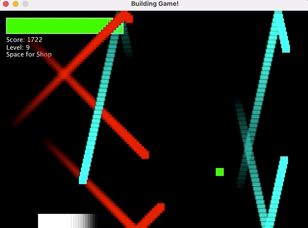

# DodgeGame
Code for Dodge game using JAVA

How did I accomplished the menu? Here is an overview.

First, I made boxes containing letters for the different menu options such as play, help, and exit. I extended to MouseAdapter, and put a boundary box in each of these options meaning if the mouse was released in either of these options then we will proceed with this option. 

The Game has two difficulties normal and hard. The difference between hard and normal is that the enemy speed increases, get smarter, different type of enemies such as fast enemy, hard enemy, enemy boss, smart enemy, and basic enemy. 

Player has a health bar, which lowers if player touches an enemy. THe score increases as player stays alive in the game. And the level increases every 250 points. 

By pressing the "p" the player can pause the game.
Pressing the space brings up the game shop

The game has a build in shop where player can upgrade health. speed, or refill health in exchange of their score. The cost increases by 100 everytime a user upgrades one of these things.
